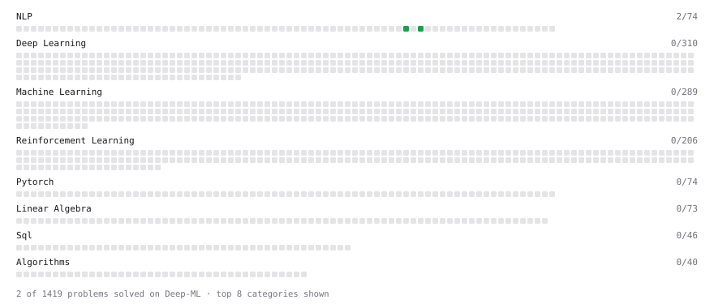

# Deep-ML

My machine learning practice from [Deep-ML](https://www.deep-ml.com). Every solution here was written by hand.

**3** solved · 3 problems · 0 labs · 0 math

[**Browse the interactive portfolio**](https://mountaincrystal.github.io/deep-ml/) to replay this filling in over time.

## Problems

| | Difficulty | Solved | |
| --- | --- | --- | --- |
| [Average Negative Log-Likelihood for Bigram Model](https://www.deep-ml.com/problems/986) | easy | 2026-09-21 | [solution](problems/0986-average-negative-log-likelihood-for-bigram-model) |
| [Build Bigram Count Matrix from Words](https://www.deep-ml.com/problems/983) | easy | 2026-09-21 | [solution](problems/0983-build-bigram-count-matrix-from-words) |
| [Laplace Smoothing for Bigram Probabilities](https://www.deep-ml.com/problems/987) | easy | 2026-09-21 | [solution](problems/0987-laplace-smoothing-for-bigram-probabilities) |

---

_This file is regenerated by Deep-ML on every push._
